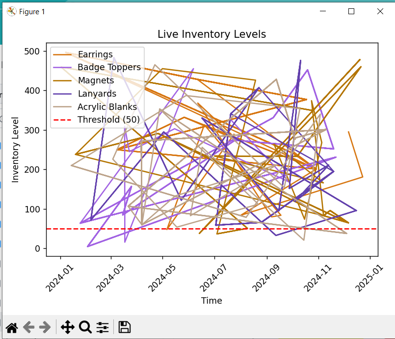

# custom-06-valjohnson
This is a custom repository to hold my custom week 6 project for Streaming Data

# Link to GitHub repo for custom project
https://github.com/Valpal84/custom-06-valjohnson

# Project Introduction
With this project I'm going to create my own data pertaining to inventory levels for a crafting business. For this example there will be various different inventory items and varying inventory levels relating to random dates and times. I'm going to create a producer to read in these different inventory levels that are associated with random dates and times. Then I will create a consumer that will read the inventory levels from the producer and create a line chart that will showcase different inventory levels that are available for the items listed during the random dates and times. They will be compared to a minimum threshold. Once an inventory level falls below a certain threshold an alert will ensue suggesting to reorder inventory. 

After the peer review, I modified the consumer script to ignore the timestamp in hopes that it would mitigate some of the chart confusion. It did help some and I also decided to chart the inventory averages as the messages are being received. So it does make the chart look a little busy but not quite as busy as before. 

# Project Insight
This project uses a kafka consumer that processes csv messages from a kafka topic. The messages from the producer will subsequently be stored in a SQLite database called "inventorylevels.db". When looking at the chart, you'll see a red dashed line representing the inventory threshold for reorder. 

# VS Code Extensions
 - Black Formatter by Microsoft
 - Markdown All in One by Yu Zhang
 - PowerShell by Microsoft (on Windows Machines)
 - Pylance by Microsoft
 - Python by Microsoft
 - Python Debugger by Microsoft
 - Ruff by Astral Software (Linter)
 - SQLite Viewer by Florian Klampfer
 - WSL by Microsoft (on Windows Machines)

# Tasks to start this project
1. Fork the REPO to your own device
2. Create a local virtual environment .venv (you'll want to use python 3.11 for this)
    - py -3.11 -m venv .venv (for windows)
    - python3 -3.11 -m venv .venv (Mac)
3. Manage local virtual environment
4. Install necessary dependencies into virtual environment (replace py with python3 for Mac/Linux)
    - py -m pip install --upgrade pip setuptools wheel (windows)
    - py -m pip install --upgrade -r requirements.txt (windows)
5. Start Zookeeper services
    - cd ~/kafka
    - chmod +x zookeeper-server-start.sh
    - bin/zookeeper-server-start.sh config/zookeeper.properties
6. Start Kafka services
    - cd ~/kafka
    - chmod +x kafka-server-start.sh
    - bin/kafka-server-start.sh config/server.properties

# Start the kafka producer in a new terminal
1. Activate the virtual environment
    - .venv\Scripts\Activate
2. Start the producer (using windows)
    - py -m producers.producer_valjohnson
3. Start the producer (using Mac/Linux)
    - python3 -m producers.producer_valjohnson

# Start the kafka consumer in a new terminal
1. Activate the virtual environment
    - .venv\Scripts\Activate
2. Start the consumer (using windows)
    - py -m consumers.consumer_valjohnson
3. Start the consumer (using Mac/Linus)
    - python3 -m consumers.consumer_valjohnson

# Save Space
To save disk space, you can delete the .venv folder when not actively working on this project. You can always recreate it, activate it, and reinstall the necessary packages later. Managing Python virtual environments is a valuable skill.

# Example chart from running the files
It looks like scribbles across the chart, it would be cleaner if it was just specifically date related but with inventory update every so many seconds/minutes there could be multiple inventory levels throughout the day. The important thing to note is the threshold line compared to inventory levels. 

